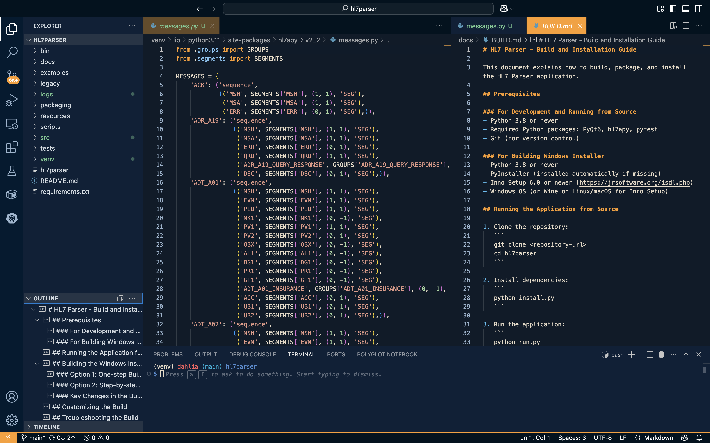
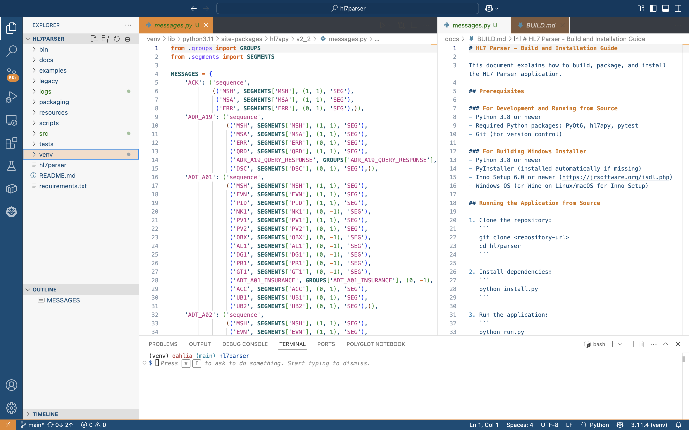
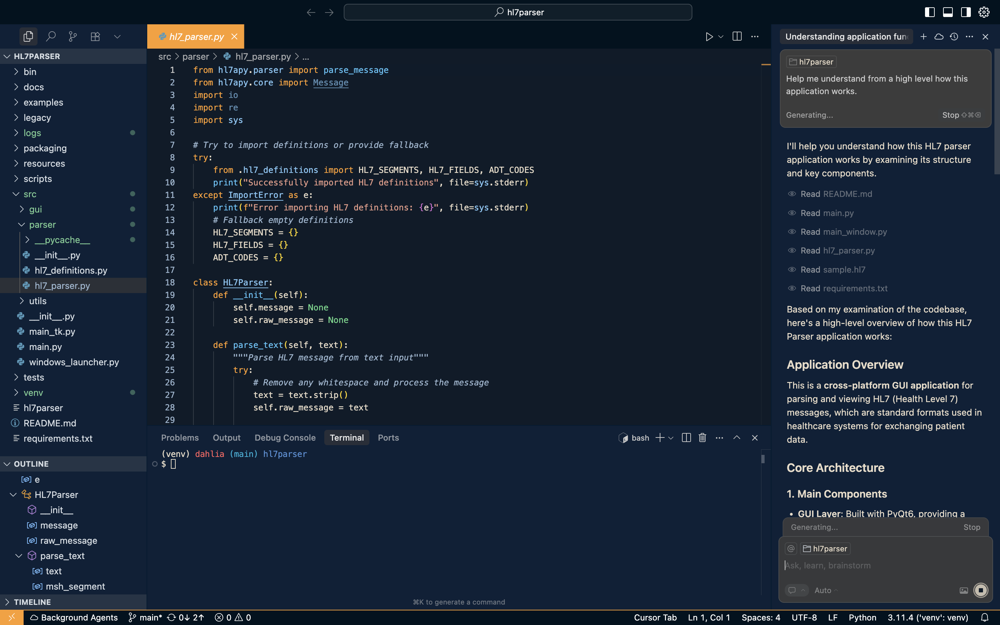
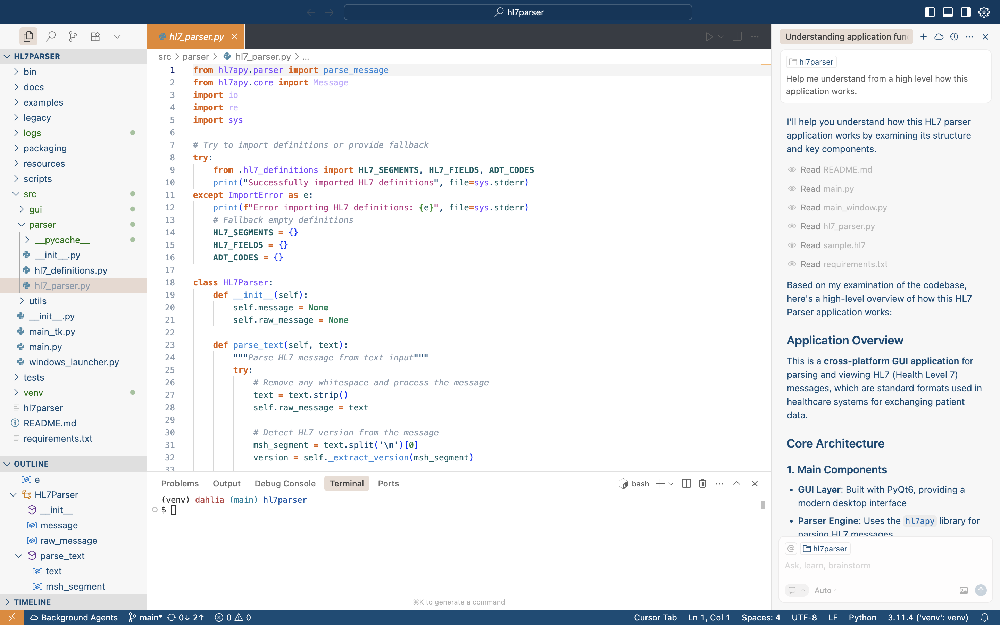
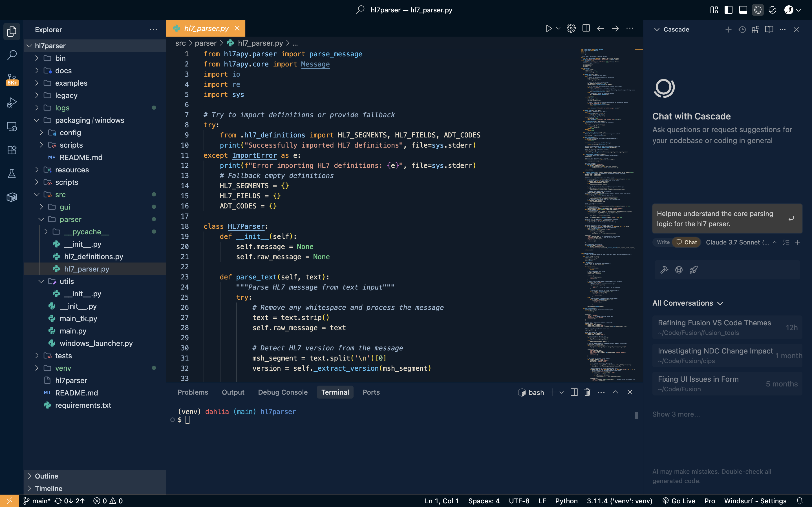
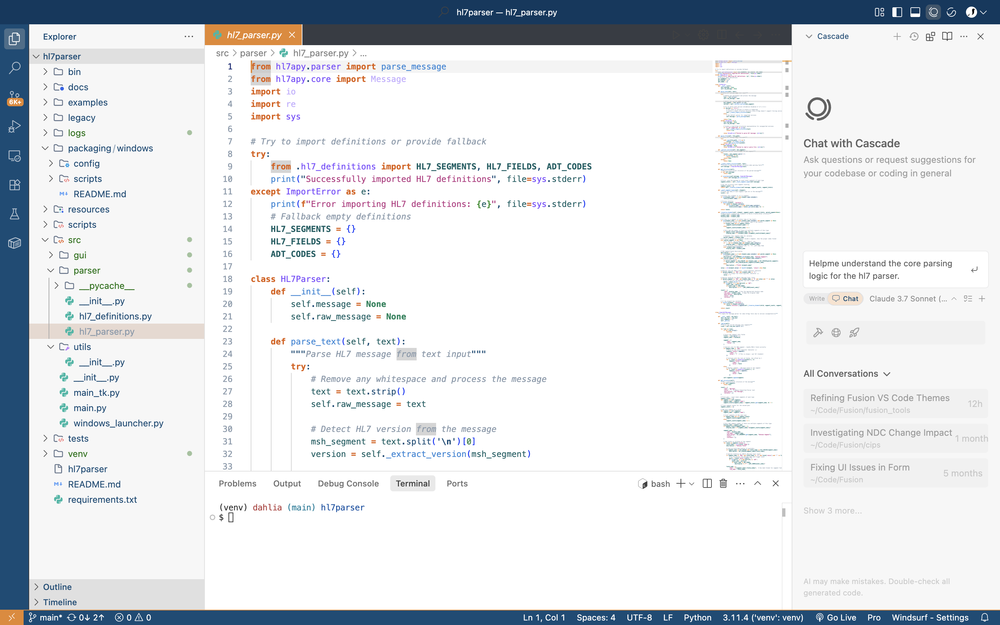

# Fusion Health Theme

**One palette – three editors**  
*VS Code · Cursor · Windsurf*

Fusion Health Theme delivers a clinically‑calibrated **dark & light** colour pair.\
Publish it once to the VS Code Marketplace and it works instantly in Cursor and Windsurf (both consume the same extension feed).

Download the theme [here](https://marketplace.visualstudio.com/items?itemName=connorengland.fusion-health).

---

### Previews




---

## ✨ Highlights

|                                                      | Dark | Light |
| ---------------------------------------------------- | ---- | ----- |
| Hand‑tuned **TextMate & semantic** colours           | ✔    | ✔     |
| Clear separation of keywords, types, functions, data | ✔    | ✔     |
| Ergonomic palette for long C/C++ sessions            | ✔    | ✔     |
| Retina‑ready icon & Marketplace banner               | ✔    | ✔     |

---

## 📦 Installation (all editors)

> **Compatible with VS Code ≥ 1.50, and all Cursor/Windsurf versions.**\
> Cursor & Windsurf read directly from the VS Code Marketplace, so a single listing covers all three.

### 1 · Marketplace *(recommended)*

For easiest installation of the theme, you can access it directly from the [VS Code Marketplace](https://marketplace.visualstudio.com/items?itemName=connorengland.fusion-health).

Or, from inside your favorite editor, do the following:

1. Press **⌘ Shift X** / **Ctrl Shift X**.
2. Search for **“Fusion Health”** (identifier `connorengland.fusion-health`) and click **Install**.
3. Press **⌘ K T** (*or* **Ctrl K T**) → pick *Fusion Dark* or *Fusion Light*.

### 2 · VSIX sideload

After cloning the repository, navigate to the root directory of the project. The VSIX file should be in the project's root or release directory.

```bash
# one file installs on every editor
VSIX=path/to/fusion-health-1.1.1.vsix  # Update path as needed
code     --install-extension $VSIX   # VS Code
cursor   --install-extension $VSIX   # Cursor
windsurf --install-extension $VSIX   # Windsurf
```

### 3 · Manual folder copy *(offline/portable)*

Drop the extension folder into the editor's **extensions directory**. After cloning the repository, use these simple commands to copy the theme to your editor's extensions directory:

| Editor   | macOS / Linux path        | Windows path                          |
| -------- | ------------------------- | ------------------------------------- |
| VS Code  | `~/.vscode/extensions/`   | `%USERPROFILE%\.vscode\extensions\`   |
| Cursor   | `~/.cursor/extensions/`   | `%USERPROFILE%\.cursor\extensions\`   |
| Windsurf | `~/.windsurf/extensions/` | `%USERPROFILE%\.windsurf\extensions\` |

```bash
# VS Code on macOS/Linux
cp -r /path/to/fusion_tools/themes/editors/vscode ~/.vscode/extensions/fusion-health-1.1.1

# Cursor on macOS/Linux
cp -r /path/to/fusion_tools/themes/editors/vscode ~/.cursor/extensions/fusion-health-1.1.1

# Windsurf on macOS/Linux
cp -r /path/to/fusion_tools/themes/editors/vscode ~/.windsurf/extensions/fusion-health-1.1.1
```

For Windows users, use PowerShell:

```powershell
# VS Code on Windows
Copy-Item -Recurse -Path C:\path\to\fusion_tools\themes\editors\vscode -Destination "$env:USERPROFILE\.vscode\extensions\fusion-health-1.1.1"

# Cursor on Windows
Copy-Item -Recurse -Path C:\path\to\fusion_tools\themes\editors\vscode -Destination "$env:USERPROFILE\.cursor\extensions\fusion-health-1.1.1"

# Windsurf on Windows
Copy-Item -Recurse -Path C:\path\to\fusion_tools\themes\editors\vscode -Destination "$env:USERPROFILE\.windsurf\extensions\fusion-health-1.1.1"
```

Restart the editor → **⌘K T / CtrlK T** → select *Fusion Dark* or *Fusion Light*.

---

## 🔧 Recommended settings snippet

```jsonc
{
  "workbench.colorTheme": "Fusion Dark",
  "editor.fontFamily": "Fira Code, JetBrains Mono, monospace",
  "editor.fontLigatures": true,
  "workbench.colorCustomizations": {
    "editorIndentGuide.activeBackground": "#FE9D26"
  }
}
```

---

## 🖼️ How it looks in other editors

### Cursor



### Windsurf



---

## 🛠️ Contributing & scope tweaks

1. Place the cursor on any token.
2. Run **Developer: Inspect Editor Tokens and Scopes**.
3. Open an issue with the scope list + screenshot.

---

## 🗒️ Changelog & licence

See [CHANGELOG.md](../CHANGELOG.md) for release notes.\
Released under the **MIT License** by Fusion Health.